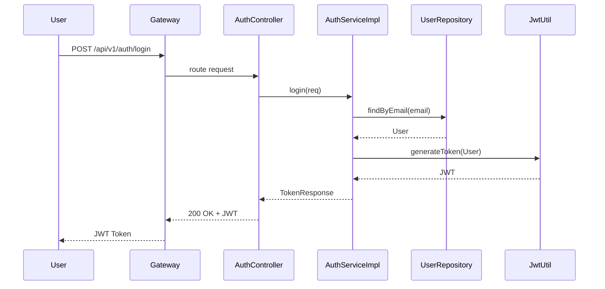

```mermaid
sequenceDiagram
    User->>Gateway: POST /api/v1/auth/login
    Gateway->>AuthController: route request
    AuthController->>AuthServiceImpl: login(req)
    AuthServiceImpl->>UserRepository: findByEmail(email)
    UserRepository-->>AuthServiceImpl: User
    AuthServiceImpl->>JwtUtil: generateToken(User)
    JwtUtil-->>AuthServiceImpl: JWT
    AuthServiceImpl-->>AuthController: TokenResponse
    AuthController-->>Gateway: 200 OK + JWT
    Gateway-->>User: JWT Token
```
