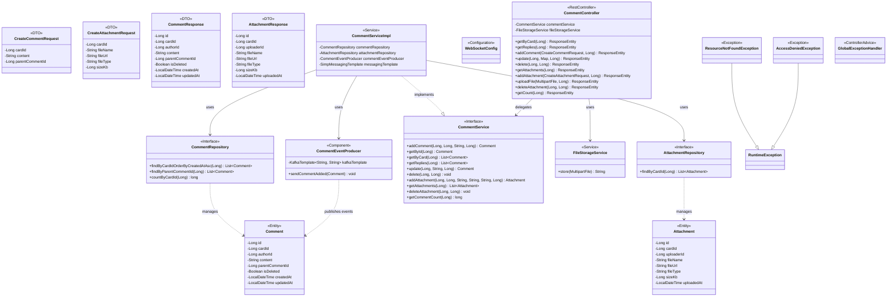

# Comment Service — Class Diagram

```mermaid
classDiagram
    direction TB

    class Comment {
        <<Entity>>
        -Long id
        -Long cardId
        -Long authorId
        -String content
        -Long parentCommentId
        -Boolean isDeleted
        -LocalDateTime createdAt
        -LocalDateTime updatedAt
    }

    class Attachment {
        <<Entity>>
        -Long id
        -Long cardId
        -Long uploaderId
        -String fileName
        -String fileUrl
        -String fileType
        -Long sizeKb
        -LocalDateTime uploadedAt
    }

    class CreateCommentRequest {
        <<DTO>>
        -Long cardId
        -String content
        -Long parentCommentId
    }

    class CreateAttachmentRequest {
        <<DTO>>
        -Long cardId
        -String fileName
        -String fileUrl
        -String fileType
        -Long sizeKb
    }

    class CommentResponse {
        <<DTO>>
        -Long id
        -Long cardId
        -Long authorId
        -String content
        -Long parentCommentId
        -Boolean isDeleted
        -LocalDateTime createdAt
        -LocalDateTime updatedAt
    }

    class AttachmentResponse {
        <<DTO>>
        -Long id
        -Long cardId
        -Long uploaderId
        -String fileName
        -String fileUrl
        -String fileType
        -Long sizeKb
        -LocalDateTime uploadedAt
    }

    class CommentRepository {
        <<Interface>>
        +findByCardIdOrderByCreatedAtAsc(Long) List~Comment~
        +findByParentCommentId(Long) List~Comment~
        +countByCardId(Long) long
    }

    class AttachmentRepository {
        <<Interface>>
        +findByCardId(Long) List~Attachment~
    }

    class CommentService {
        <<Interface>>
        +addComment(Long, Long, String, Long) Comment
        +getById(Long) Comment
        +getByCard(Long) List~Comment~
        +getReplies(Long) List~Comment~
        +update(Long, String, Long) Comment
        +delete(Long, Long) void
        +addAttachment(Long, Long, String, String, String, Long) Attachment
        +getAttachments(Long) List~Attachment~
        +deleteAttachment(Long, Long) void
        +getCommentCount(Long) long
    }

    class CommentServiceImpl {
        <<Service>>
        -CommentRepository commentRepository
        -AttachmentRepository attachmentRepository
        -CommentEventProducer commentEventProducer
        -SimpMessagingTemplate messagingTemplate
    }

    class FileStorageService {
        <<Service>>
        +store(MultipartFile) String
    }

    class CommentEventProducer {
        <<Component>>
        -KafkaTemplate~String, String~ kafkaTemplate
        +sendCommentAdded(Comment) void
    }

    class WebSocketConfig {
        <<Configuration>>
    }

    class CommentController {
        <<RestController>>
        -CommentService commentService
        -FileStorageService fileStorageService
        +getByCard(Long) ResponseEntity
        +getReplies(Long) ResponseEntity
        +addComment(CreateCommentRequest, Long) ResponseEntity
        +update(Long, Map, Long) ResponseEntity
        +delete(Long, Long) ResponseEntity
        +getAttachments(Long) ResponseEntity
        +addAttachment(CreateAttachmentRequest, Long) ResponseEntity
        +uploadFile(MultipartFile, Long) ResponseEntity
        +deleteAttachment(Long, Long) ResponseEntity
        +getCount(Long) ResponseEntity
    }

    class ResourceNotFoundException {
        <<Exception>>
    }
    class AccessDeniedException {
        <<Exception>>
    }
    class GlobalExceptionHandler {
        <<ControllerAdvice>>
    }

    CommentRepository ..> Comment : manages
    AttachmentRepository ..> Attachment : manages
    CommentServiceImpl ..|> CommentService : implements
    CommentServiceImpl --> CommentRepository : uses
    CommentServiceImpl --> AttachmentRepository : uses
    CommentServiceImpl --> CommentEventProducer : uses
    CommentController --> CommentService : delegates
    CommentController --> FileStorageService : uses
    CommentEventProducer ..> Comment : publishes events
    ResourceNotFoundException --|> RuntimeException
    AccessDeniedException --|> RuntimeException
```
