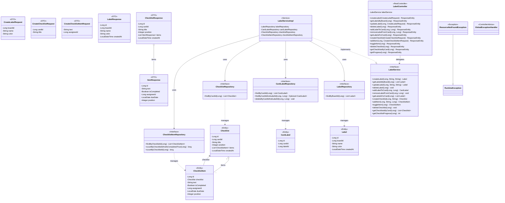

# Label Service — Class Diagram

```mermaid
classDiagram
    direction TB

    class Label {
        <<Entity>>
        -Long id
        -Long boardId
        -String name
        -String color
        -LocalDateTime createdAt
    }

    class CardLabel {
        <<Entity>>
        -Long id
        -Long cardId
        -Long labelId
    }

    class Checklist {
        <<Entity>>
        -Long id
        -Long cardId
        -String title
        -Integer position
        -List~ChecklistItem~ items
        -LocalDateTime createdAt
    }

    class ChecklistItem {
        <<Entity>>
        -Long id
        -Checklist checklist
        -String text
        -Boolean isCompleted
        -Long assigneeId
        -LocalDate dueDate
        -Integer position
    }

    Checklist "1" o-- "*" ChecklistItem : items
    ChecklistItem --> Checklist : checklist

    class CreateLabelRequest {
        <<DTO>>
        -Long boardId
        -String name
        -String color
    }

    class CreateChecklistRequest {
        <<DTO>>
        -Long cardId
        -String title
    }

    class CreateChecklistItemRequest {
        <<DTO>>
        -String text
        -Long assigneeId
    }

    class LabelResponse {
        <<DTO>>
        -Long id
        -Long boardId
        -String name
        -String color
        -LocalDateTime createdAt
    }

    class ChecklistResponse {
        <<DTO>>
        -Long id
        -Long cardId
        -String title
        -Integer position
        -List~ItemResponse~ items
        -LocalDateTime createdAt
    }

    class ItemResponse {
        <<DTO>>
        -Long id
        -String text
        -Boolean isCompleted
        -Long assigneeId
        -LocalDate dueDate
        -Integer position
    }

    ChecklistResponse o-- ItemResponse : items

    class LabelRepository {
        <<Interface>>
        +findByBoardId(Long) List~Label~
    }

    class CardLabelRepository {
        <<Interface>>
        +findByCardId(Long) List~CardLabel~
        +findByCardIdAndLabelId(Long, Long) Optional~CardLabel~
        +deleteByCardIdAndLabelId(Long, Long) void
    }

    class ChecklistRepository {
        <<Interface>>
        +findByCardId(Long) List~Checklist~
    }

    class ChecklistItemRepository {
        <<Interface>>
        +findByChecklistId(Long) List~ChecklistItem~
        +countByChecklistIdAndIsCompletedTrue(Long) long
        +countByChecklistId(Long) long
    }

    class LabelService {
        <<Interface>>
        +createLabel(Long, String, String) Label
        +getLabelsByBoard(Long) List~Label~
        +updateLabel(Long, String, String) Label
        +deleteLabel(Long) void
        +addLabelToCard(Long, Long) CardLabel
        +removeLabelFromCard(Long, Long) void
        +getLabelsForCard(Long) List~Label~
        +createChecklist(Long, String) Checklist
        +addItem(Long, String, Long) ChecklistItem
        +toggleItem(Long) ChecklistItem
        +deleteChecklist(Long) void
        +getChecklistsByCard(Long) List~Checklist~
        +getChecklistProgress(Long) int
    }

    class LabelServiceImpl {
        <<Service>>
        -LabelRepository labelRepository
        -CardLabelRepository cardLabelRepository
        -ChecklistRepository checklistRepository
        -ChecklistItemRepository checklistItemRepository
    }

    class LabelController {
        <<RestController>>
        -LabelService labelService
        +createLabel(CreateLabelRequest) ResponseEntity
        +getLabelsByBoard(Long) ResponseEntity
        +updateLabel(Long, CreateLabelRequest) ResponseEntity
        +deleteLabel(Long) ResponseEntity
        +addLabelToCard(Long, Long) ResponseEntity
        +removeLabelFromCard(Long, Long) ResponseEntity
        +getLabelsForCard(Long) ResponseEntity
        +createChecklist(CreateChecklistRequest) ResponseEntity
        +addItem(Long, CreateChecklistItemRequest) ResponseEntity
        +toggleItem(Long) ResponseEntity
        +deleteChecklist(Long) ResponseEntity
        +getChecklistsByCard(Long) ResponseEntity
        +getProgress(Long) ResponseEntity
    }

    class ResourceNotFoundException {
        <<Exception>>
    }
    class GlobalExceptionHandler {
        <<ControllerAdvice>>
    }

    LabelRepository ..> Label : manages
    CardLabelRepository ..> CardLabel : manages
    ChecklistRepository ..> Checklist : manages
    ChecklistItemRepository ..> ChecklistItem : manages
    LabelServiceImpl ..|> LabelService : implements
    LabelServiceImpl --> LabelRepository : uses
    LabelServiceImpl --> CardLabelRepository : uses
    LabelServiceImpl --> ChecklistRepository : uses
    LabelServiceImpl --> ChecklistItemRepository : uses
    LabelController --> LabelService : delegates
    ResourceNotFoundException --|> RuntimeException
```
