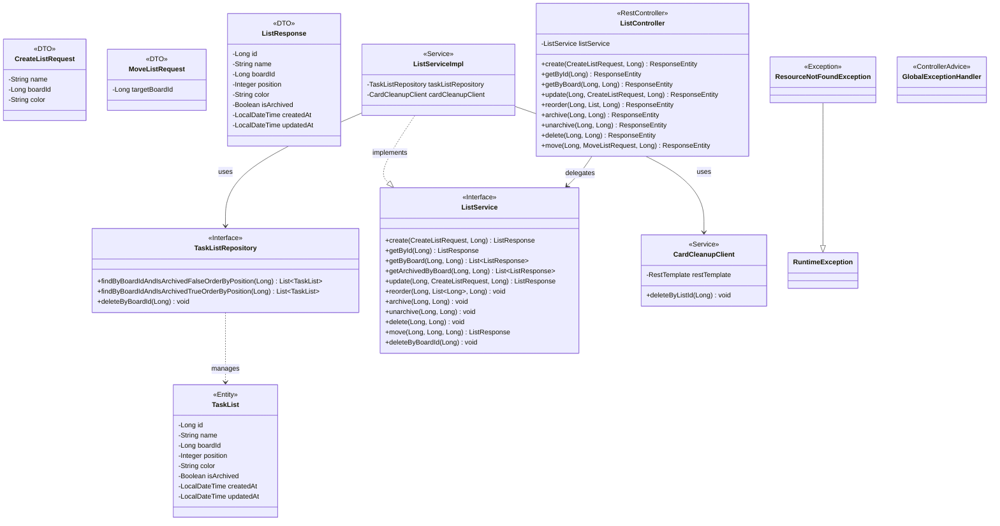

# List Service — Class Diagram

```mermaid
classDiagram
    direction TB

    class TaskList {
        <<Entity>>
        -Long id
        -String name
        -Long boardId
        -Integer position
        -String color
        -Boolean isArchived
        -LocalDateTime createdAt
        -LocalDateTime updatedAt
    }

    class CreateListRequest {
        <<DTO>>
        -String name
        -Long boardId
        -String color
    }

    class MoveListRequest {
        <<DTO>>
        -Long targetBoardId
    }

    class ListResponse {
        <<DTO>>
        -Long id
        -String name
        -Long boardId
        -Integer position
        -String color
        -Boolean isArchived
        -LocalDateTime createdAt
        -LocalDateTime updatedAt
    }

    class TaskListRepository {
        <<Interface>>
        +findByBoardIdAndIsArchivedFalseOrderByPosition(Long) List~TaskList~
        +findByBoardIdAndIsArchivedTrueOrderByPosition(Long) List~TaskList~
        +deleteByBoardId(Long) void
    }

    class ListService {
        <<Interface>>
        +create(CreateListRequest, Long) ListResponse
        +getById(Long) ListResponse
        +getByBoard(Long, Long) List~ListResponse~
        +getArchivedByBoard(Long, Long) List~ListResponse~
        +update(Long, CreateListRequest, Long) ListResponse
        +reorder(Long, List~Long~, Long) void
        +archive(Long, Long) void
        +unarchive(Long, Long) void
        +delete(Long, Long) void
        +move(Long, Long, Long) ListResponse
        +deleteByBoardId(Long) void
    }

    class ListServiceImpl {
        <<Service>>
        -TaskListRepository taskListRepository
        -CardCleanupClient cardCleanupClient
    }

    class CardCleanupClient {
        <<Service>>
        -RestTemplate restTemplate
        +deleteByListId(Long) void
    }

    class ListController {
        <<RestController>>
        -ListService listService
        +create(CreateListRequest, Long) ResponseEntity
        +getById(Long) ResponseEntity
        +getByBoard(Long, Long) ResponseEntity
        +update(Long, CreateListRequest, Long) ResponseEntity
        +reorder(Long, List, Long) ResponseEntity
        +archive(Long, Long) ResponseEntity
        +unarchive(Long, Long) ResponseEntity
        +delete(Long, Long) ResponseEntity
        +move(Long, MoveListRequest, Long) ResponseEntity
    }

    class ResourceNotFoundException {
        <<Exception>>
    }
    class GlobalExceptionHandler {
        <<ControllerAdvice>>
    }

    TaskListRepository ..> TaskList : manages
    ListServiceImpl ..|> ListService : implements
    ListServiceImpl --> TaskListRepository : uses
    ListServiceImpl --> CardCleanupClient : uses
    ListController --> ListService : delegates
    ResourceNotFoundException --|> RuntimeException
```
