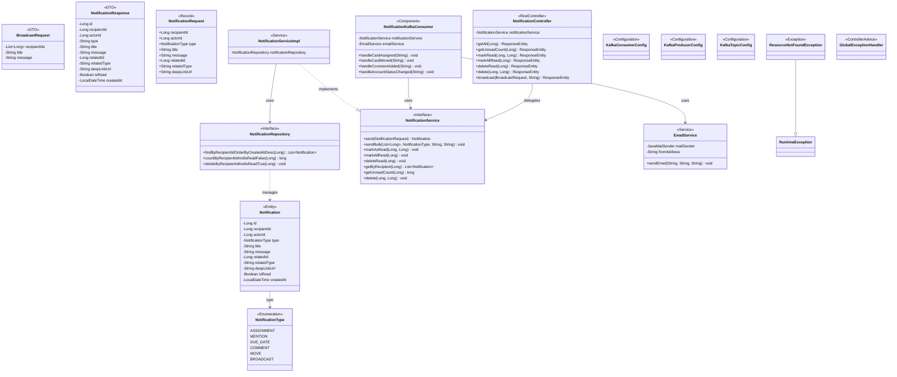

# Notification Service — Class Diagram

```mermaid
classDiagram
    direction TB

    class Notification {
        <<Entity>>
        -Long id
        -Long recipientId
        -Long actorId
        -NotificationType type
        -String title
        -String message
        -Long relatedId
        -String relatedType
        -String deepLinkUrl
        -Boolean isRead
        -LocalDateTime createdAt
    }

    class NotificationType {
        <<Enumeration>>
        ASSIGNMENT
        MENTION
        DUE_DATE
        COMMENT
        MOVE
        BROADCAST
    }

    Notification --> NotificationType : type

    class BroadcastRequest {
        <<DTO>>
        -List~Long~ recipientIds
        -String title
        -String message
    }

    class NotificationResponse {
        <<DTO>>
        -Long id
        -Long recipientId
        -Long actorId
        -String type
        -String title
        -String message
        -Long relatedId
        -String relatedType
        -String deepLinkUrl
        -Boolean isRead
        -LocalDateTime createdAt
    }

    class NotificationRepository {
        <<Interface>>
        +findByRecipientIdOrderByCreatedAtDesc(Long) List~Notification~
        +countByRecipientIdAndIsReadFalse(Long) long
        +deleteByRecipientIdAndIsReadTrue(Long) void
    }

    class NotificationRequest {
        <<Record>>
        +Long recipientId
        +Long actorId
        +NotificationType type
        +String title
        +String message
        +Long relatedId
        +String relatedType
        +String deepLinkUrl
    }

    class NotificationService {
        <<Interface>>
        +send(NotificationRequest) Notification
        +sendBulk(List~Long~, NotificationType, String, String) void
        +markAsRead(Long, Long) void
        +markAllRead(Long) void
        +deleteRead(Long) void
        +getByRecipient(Long) List~Notification~
        +getUnreadCount(Long) long
        +delete(Long, Long) void
    }

    class NotificationServiceImpl {
        <<Service>>
        -NotificationRepository notificationRepository
    }

    class EmailService {
        <<Service>>
        -JavaMailSender mailSender
        -String fromAddress
        +sendEmail(String, String, String) void
    }

    class NotificationKafkaConsumer {
        <<Component>>
        -NotificationService notificationService
        -EmailService emailService
        +handleCardAssigned(String) void
        +handleCardMoved(String) void
        +handleCommentAdded(String) void
        +handleAccountStatusChanged(String) void
    }

    class NotificationController {
        <<RestController>>
        -NotificationService notificationService
        +getAll(Long) ResponseEntity
        +getUnreadCount(Long) ResponseEntity
        +markRead(Long, Long) ResponseEntity
        +markAllRead(Long) ResponseEntity
        +deleteRead(Long) ResponseEntity
        +delete(Long, Long) ResponseEntity
        +broadcast(BroadcastRequest, String) ResponseEntity
    }

    class KafkaConsumerConfig {
        <<Configuration>>
    }
    class KafkaProducerConfig {
        <<Configuration>>
    }
    class KafkaTopicConfig {
        <<Configuration>>
    }

    class ResourceNotFoundException {
        <<Exception>>
    }
    class GlobalExceptionHandler {
        <<ControllerAdvice>>
    }

    NotificationRepository ..> Notification : manages
    NotificationServiceImpl ..|> NotificationService : implements
    NotificationServiceImpl --> NotificationRepository : uses
    NotificationKafkaConsumer --> NotificationService : uses
    NotificationKafkaConsumer --> EmailService : uses
    NotificationController --> NotificationService : delegates
    ResourceNotFoundException --|> RuntimeException
```
