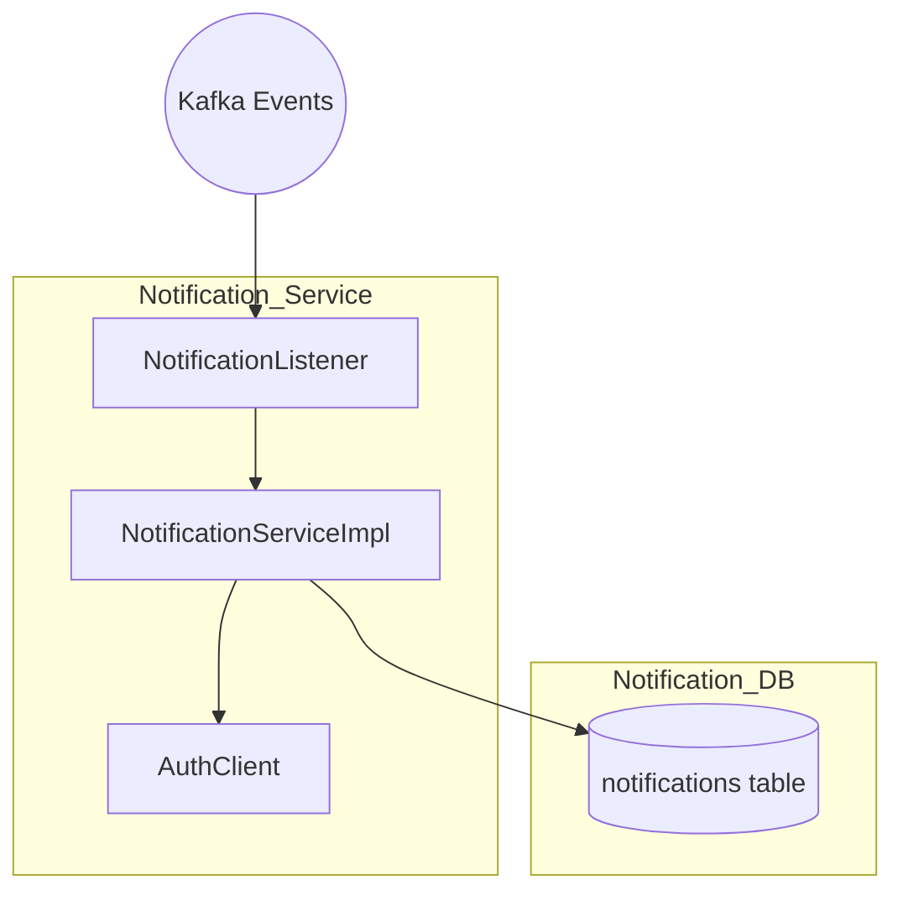

```mermaid
flowchart TD
    subgraph Notification_Service
        NotificationListener
        NotificationServiceImpl
        AuthClient
    end
    subgraph Notification_DB
        notifications[(notifications table)]
    end
    Kafka((Kafka Events)) --> NotificationListener
    NotificationListener --> NotificationServiceImpl
    NotificationServiceImpl --> notifications
    NotificationServiceImpl --> AuthClient
```
