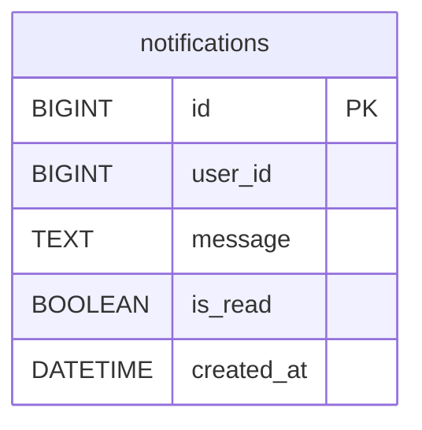
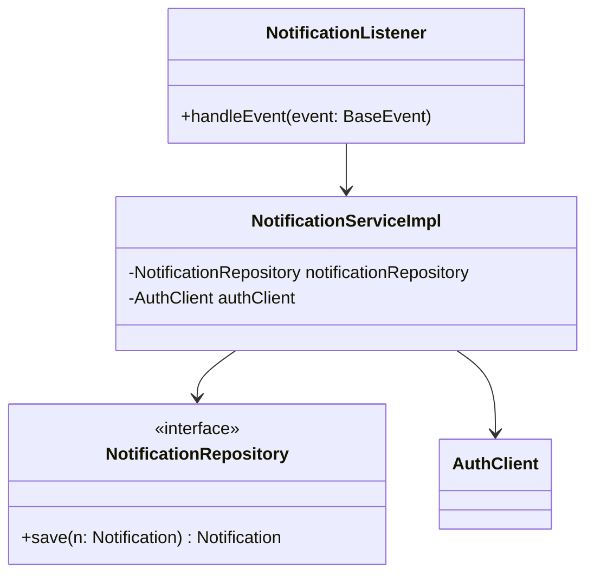
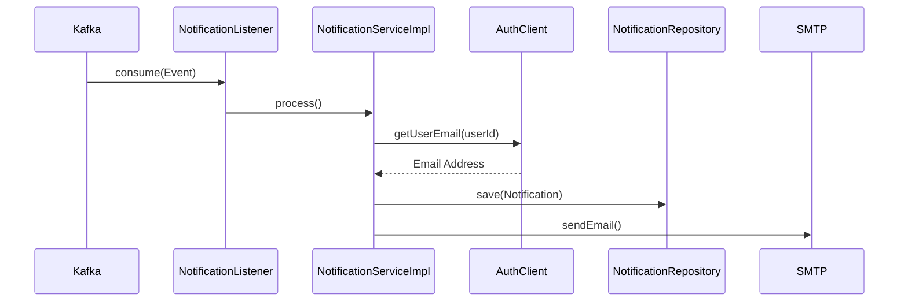
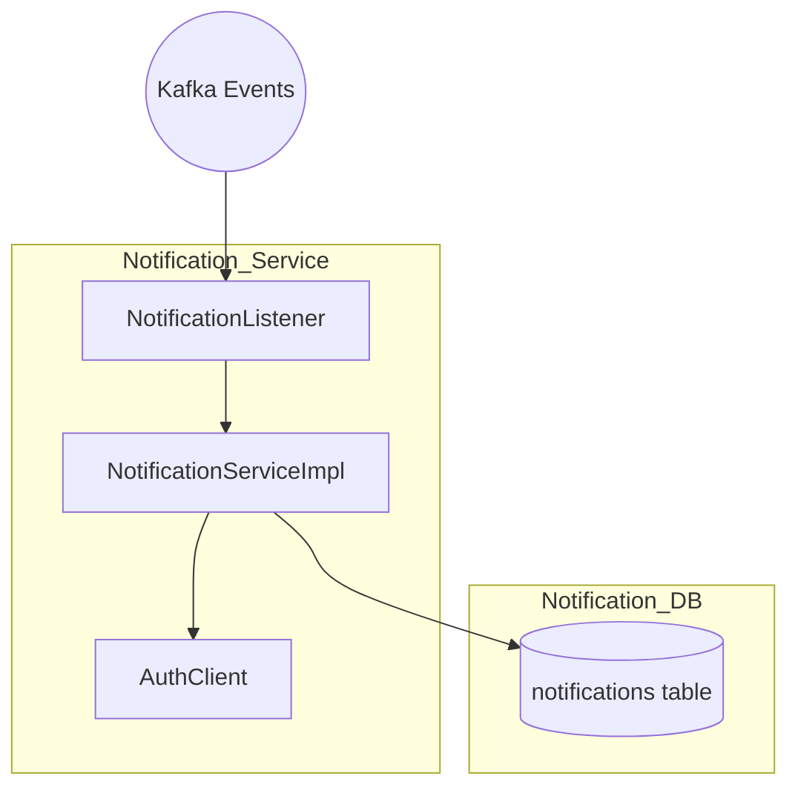

# Notification Service Diagrams

## ER Diagram

```mermaid
erDiagram
    notifications {
        BIGINT id PK
        BIGINT user_id
        TEXT message
        BOOLEAN is_read
        DATETIME created_at
    }
```

## Class Diagram

```mermaid
classDiagram
    class NotificationListener {
        +handleEvent(event: BaseEvent)
    }
    class NotificationServiceImpl {
        -NotificationRepository notificationRepository
        -AuthClient authClient
    }
    class NotificationRepository {
        <<interface>>
        +save(n: Notification) Notification
    }
    NotificationListener --> NotificationServiceImpl
    NotificationServiceImpl --> NotificationRepository
    NotificationServiceImpl --> AuthClient
```

## Sequence Diagram

```mermaid
sequenceDiagram
    Kafka->>NotificationListener: consume(Event)
    NotificationListener->>NotificationServiceImpl: process()
    NotificationServiceImpl->>AuthClient: getUserEmail(userId)
    AuthClient-->>NotificationServiceImpl: Email Address
    NotificationServiceImpl->>NotificationRepository: save(Notification)
    NotificationServiceImpl->>SMTP: sendEmail()
```

## Component Diagram

```mermaid
flowchart TD
    subgraph Notification_Service
        NotificationListener
        NotificationServiceImpl
        AuthClient
    end
    subgraph Notification_DB
        notifications[(notifications table)]
    end
    Kafka((Kafka Events)) --> NotificationListener
    NotificationListener --> NotificationServiceImpl
    NotificationServiceImpl --> notifications
    NotificationServiceImpl --> AuthClient
```
