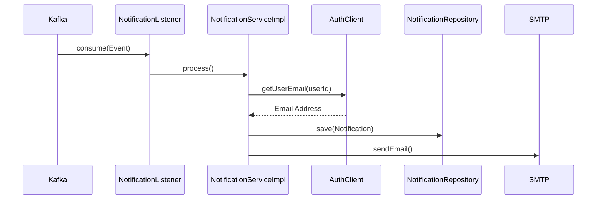

```mermaid
sequenceDiagram
    Kafka->>NotificationListener: consume(Event)
    NotificationListener->>NotificationServiceImpl: process()
    NotificationServiceImpl->>AuthClient: getUserEmail(userId)
    AuthClient-->>NotificationServiceImpl: Email Address
    NotificationServiceImpl->>NotificationRepository: save(Notification)
    NotificationServiceImpl->>SMTP: sendEmail()
```
