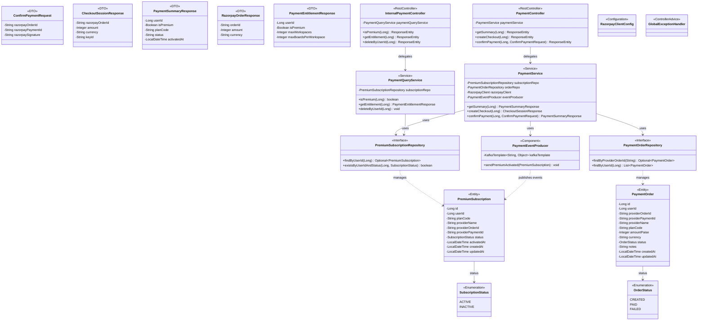

# Payment Service — Class Diagram

```mermaid
classDiagram
    direction TB

    class PremiumSubscription {
        <<Entity>>
        -Long id
        -Long userId
        -String planCode
        -String providerName
        -String providerOrderId
        -String providerPaymentId
        -SubscriptionStatus status
        -LocalDateTime activatedAt
        -LocalDateTime createdAt
        -LocalDateTime updatedAt
    }

    class SubscriptionStatus {
        <<Enumeration>>
        ACTIVE
        INACTIVE
    }

    class PaymentOrder {
        <<Entity>>
        -Long id
        -Long userId
        -String providerOrderId
        -String providerPaymentId
        -String providerName
        -String planCode
        -Integer amountPaise
        -String currency
        -OrderStatus status
        -String notes
        -LocalDateTime createdAt
        -LocalDateTime updatedAt
    }

    class OrderStatus {
        <<Enumeration>>
        CREATED
        PAID
        FAILED
    }

    PremiumSubscription --> SubscriptionStatus : status
    PaymentOrder --> OrderStatus : status

    class ConfirmPaymentRequest {
        <<DTO>>
        -String razorpayOrderId
        -String razorpayPaymentId
        -String razorpaySignature
    }

    class CheckoutSessionResponse {
        <<DTO>>
        -String razorpayOrderId
        -Integer amount
        -String currency
        -String keyId
    }

    class PaymentSummaryResponse {
        <<DTO>>
        -Long userId
        -Boolean isPremium
        -String planCode
        -String status
        -LocalDateTime activatedAt
    }

    class RazorpayOrderResponse {
        <<DTO>>
        -String orderId
        -Integer amount
        -String currency
    }

    class PaymentEntitlementResponse {
        <<DTO>>
        -Long userId
        -Boolean isPremium
        -Integer maxWorkspaces
        -Integer maxBoardsPerWorkspace
    }

    class PremiumSubscriptionRepository {
        <<Interface>>
        +findByUserId(Long) Optional~PremiumSubscription~
        +existsByUserIdAndStatus(Long, SubscriptionStatus) boolean
    }

    class PaymentOrderRepository {
        <<Interface>>
        +findByProviderOrderId(String) Optional~PaymentOrder~
        +findByUserId(Long) List~PaymentOrder~
    }

    class PaymentService {
        <<Service>>
        -PremiumSubscriptionRepository subscriptionRepo
        -PaymentOrderRepository orderRepo
        -RazorpayClient razorpayClient
        -PaymentEventProducer eventProducer
        +getSummary(Long) PaymentSummaryResponse
        +createCheckout(Long) CheckoutSessionResponse
        +confirmPayment(Long, ConfirmPaymentRequest) PaymentSummaryResponse
    }

    class PaymentQueryService {
        <<Service>>
        -PremiumSubscriptionRepository subscriptionRepo
        +isPremium(Long) boolean
        +getEntitlement(Long) PaymentEntitlementResponse
        +deleteByUserId(Long) void
    }

    class PaymentEventProducer {
        <<Component>>
        -KafkaTemplate~String, Object~ kafkaTemplate
        +sendPremiumActivated(PremiumSubscription) void
    }

    class PaymentController {
        <<RestController>>
        -PaymentService paymentService
        +getSummary(Long) ResponseEntity
        +createCheckout(Long) ResponseEntity
        +confirmPayment(Long, ConfirmPaymentRequest) ResponseEntity
    }

    class InternalPaymentController {
        <<RestController>>
        -PaymentQueryService paymentQueryService
        +isPremium(Long) ResponseEntity
        +getEntitlement(Long) ResponseEntity
        +deleteByUserId(Long) ResponseEntity
    }

    class RazorpayClientConfig {
        <<Configuration>>
    }
    class GlobalExceptionHandler {
        <<ControllerAdvice>>
    }

    PremiumSubscriptionRepository ..> PremiumSubscription : manages
    PaymentOrderRepository ..> PaymentOrder : manages
    PaymentService --> PremiumSubscriptionRepository : uses
    PaymentService --> PaymentOrderRepository : uses
    PaymentService --> PaymentEventProducer : uses
    PaymentQueryService --> PremiumSubscriptionRepository : uses
    PaymentController --> PaymentService : delegates
    InternalPaymentController --> PaymentQueryService : delegates
    PaymentEventProducer ..> PremiumSubscription : publishes events
```
