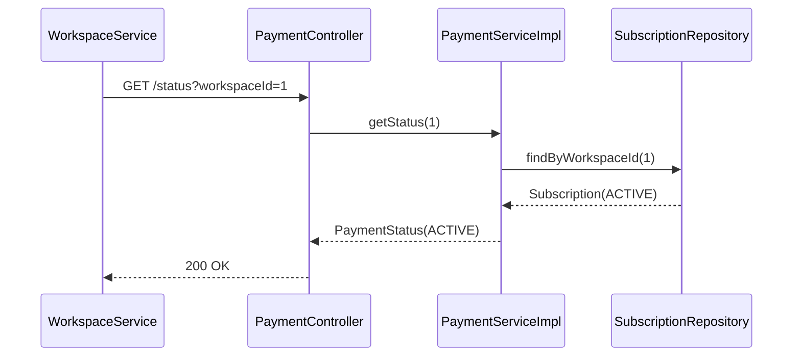

```mermaid
sequenceDiagram
    WorkspaceService->>PaymentController: GET /status?workspaceId=1
    PaymentController->>PaymentServiceImpl: getStatus(1)
    PaymentServiceImpl->>SubscriptionRepository: findByWorkspaceId(1)
    SubscriptionRepository-->>PaymentServiceImpl: Subscription(ACTIVE)
    PaymentServiceImpl-->>PaymentController: PaymentStatus(ACTIVE)
    PaymentController-->>WorkspaceService: 200 OK
```
