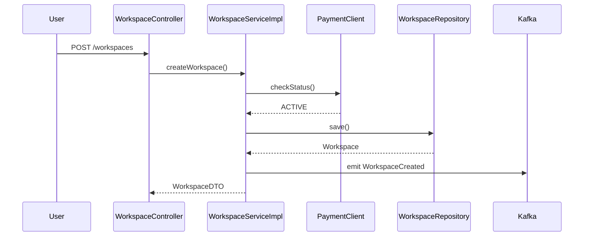

```mermaid
sequenceDiagram
    User->>WorkspaceController: POST /workspaces
    WorkspaceController->>WorkspaceServiceImpl: createWorkspace()
    WorkspaceServiceImpl->>PaymentClient: checkStatus()
    PaymentClient-->>WorkspaceServiceImpl: ACTIVE
    WorkspaceServiceImpl->>WorkspaceRepository: save()
    WorkspaceRepository-->>WorkspaceServiceImpl: Workspace
    WorkspaceServiceImpl->>Kafka: emit WorkspaceCreated
    WorkspaceServiceImpl-->>WorkspaceController: WorkspaceDTO
```
