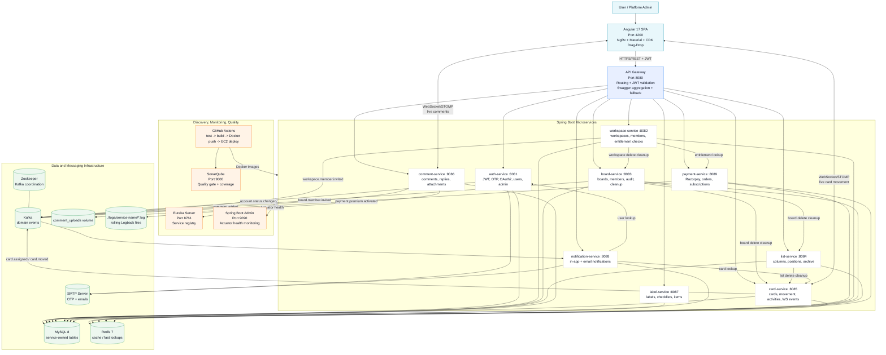

# FlowBoard Detailed System Architecture

```mermaid
flowchart TB
    User[User / Platform Admin] --> Browser[Angular 17 SPA<br/>Port 4200<br/>NgRx + Material + CDK Drag-Drop]

    Browser -->|HTTPS/REST + JWT| Gateway[API Gateway<br/>Port 8080<br/>Routing + JWT validation<br/>Swagger aggregation + fallback]

    subgraph Discovery_Observability["Discovery, Monitoring, Quality"]
        Eureka[Eureka Server<br/>Port 8761<br/>Service registry]
        Admin[Spring Boot Admin<br/>Port 9090<br/>Actuator health monitoring]
        Sonar[SonarQube<br/>Port 9000<br/>Quality gate + coverage]
        GitHub[GitHub Actions<br/>test -> build -> Docker push -> EC2 deploy]
    end

    subgraph Core_Domain["Spring Boot Microservices"]
        Auth[auth-service :8081<br/>JWT, OTP, OAuth2, users, admin]
        Workspace[workspace-service :8082<br/>workspaces, members, entitlement checks]
        Board[board-service :8083<br/>boards, members, audit, cleanup]
        List[list-service :8084<br/>columns, positions, archive]
        Card[card-service :8085<br/>cards, movement, activities, WS events]
        Comment[comment-service :8086<br/>comments, replies, attachments]
        Label[label-service :8087<br/>labels, checklists, items]
        Notification[notification-service :8088<br/>in-app + email notifications]
        Payment[payment-service :8089<br/>Razorpay, orders, subscriptions]
    end

    subgraph Data_Infra["Data and Messaging Infrastructure"]
        MySQL[(MySQL 8<br/>service-owned tables)]
        Redis[(Redis 7<br/>cache / fast lookups)]
        Kafka[(Kafka<br/>domain events)]
        Zookeeper[(Zookeeper<br/>Kafka coordination)]
        SMTP[(SMTP Server<br/>OTP + emails)]
        Uploads[(comment_uploads volume)]
        Logs[(./logs/service-name/*.log<br/>rolling Logback files)]
    end

    Gateway --> Auth
    Gateway --> Workspace
    Gateway --> Board
    Gateway --> List
    Gateway --> Card
    Gateway --> Comment
    Gateway --> Label
    Gateway --> Notification
    Gateway --> Payment

    Workspace -->|entitlement lookup| Payment
    Workspace -->|workspace delete cleanup| Board
    Board -->|board delete cleanup| List
    Board -->|board delete cleanup| Card
    List -->|list delete cleanup| Card
    Notification -->|user lookup| Auth
    Notification -->|card lookup| Card

    Auth --> MySQL
    Workspace --> MySQL
    Board --> MySQL
    List --> MySQL
    Card --> MySQL
    Comment --> MySQL
    Label --> MySQL
    Notification --> MySQL
    Payment --> MySQL

    Workspace --> Redis
    Board --> Redis
    List --> Redis
    Card --> Redis
    Payment --> Redis

    Auth -->|account.status.changed| Kafka
    Workspace -->|workspace.member.invited| Kafka
    Board -->|board.member.invited| Kafka
    Card -->|card.assigned / card.moved| Kafka
    Comment -->|comment.added| Kafka
    Payment -->|payment.premium.activated| Kafka
    Kafka --> Notification
    Zookeeper --- Kafka

    Auth --> SMTP
    Notification --> SMTP
    Comment --> Uploads

    Card <-->|WebSocket/STOMP<br/>live card movement| Browser
    Comment <-->|WebSocket/STOMP<br/>live comments| Browser

    Core_Domain -->|registers| Eureka
    Core_Domain -->|Actuator health| Admin
    Core_Domain --> Logs
    GitHub --> Sonar
    GitHub -->|Docker images| Core_Domain

    classDef client fill:#e8f7fb,stroke:#1f99b5,color:#111827
    classDef gateway fill:#e8efff,stroke:#2d83f5,color:#111827
    classDef service fill:#ffffff,stroke:#d9d6cf,color:#111827
    classDef infra fill:#edf7ef,stroke:#40a367,color:#111827
    classDef quality fill:#fff3e7,stroke:#f5832d,color:#111827

    class Browser,User client
    class Gateway gateway
    class Auth,Workspace,Board,List,Card,Comment,Label,Notification,Payment service
    class MySQL,Redis,Kafka,Zookeeper,SMTP,Uploads,Logs infra
    class Eureka,Admin,Sonar,GitHub quality
```
